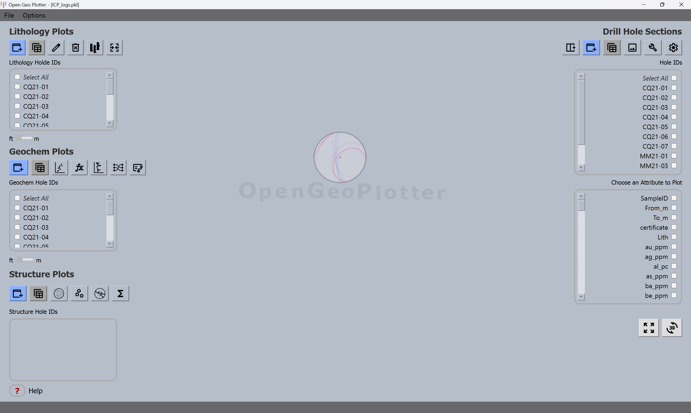
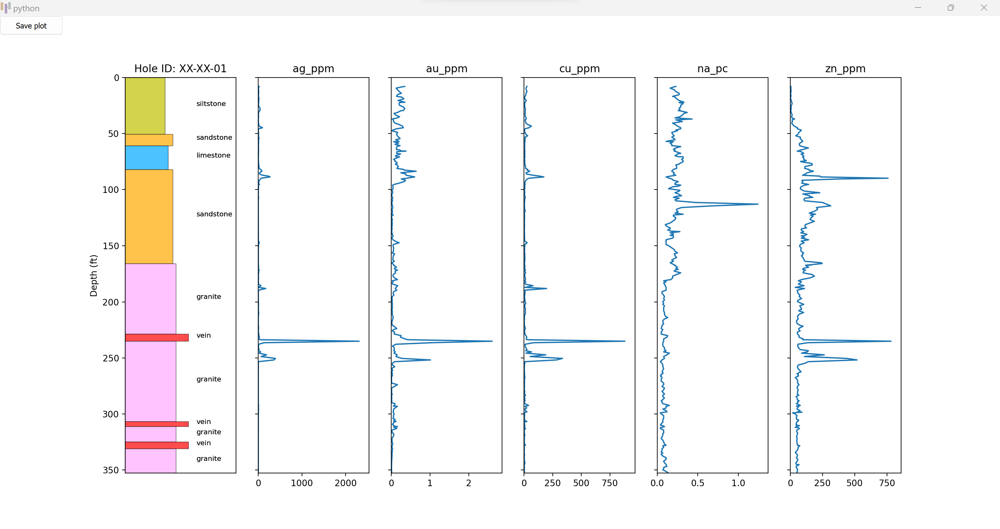

# **Installation Instructions**

***Requires Python version 3.11 or up***

Download all files from 'master' branch (click Code -> Download ZIP)

Extract the contents of the ZIP and open a terminal from the OpenGeoPlotter-master folder (for windows users, right-click on the folder and click 'Open in Terminal').

install requirements in your envoirnment via:

`pip install -r requirements.txt`

Run the main script (OGP_v11.py) from the directory hosting the 'master' branch files via:

`python OGP_v11.py`

From here the GUI will open, and all functions are performed within. 

# **Application Use Instructions**

**IMPORTANT NOTE FOR DATA IMPORT**  All CSV’s must contain a column header titled “hole_id”. This is what populates your selection boxes. Any desurveyed data must contain columns “x”, “y” and “z” matching exactly, no uppercase.

This application is designed to import, process, and visualize geological drill hole data. The application uses a graphical user interface built with PyQt5, a Python binding for the Qt application framework.

When you start the application, you will be presented with a main window. The main window provides you with controls for importing data, selecting hole IDs, managing attributes, and generating plots.

### IMPORT DATA 

The import buttons allow you to import your drill hole data. The data should be in a .csv format and contain columns for "hole_id" and depth, as well as any other attributes you are interested in. The program relies on a good clean CSV and does not provide any data manipulation in the table once it is imported. Please ensure your data does not contain NaNs (less than symbols etc) or inf values for numerical data. Most importantly, please ensure your column name for the hole ID is "hole_id" the program relies on this exact naming of the hole ID column.

Import Data Format Example: (data for cross section plots need "x", "y", and "z" ie desurveyed data)

| hole_id | depth_from | depth_to | Mg_ppm | Al_ppm | Fe_ppm | Au_g/t |
|---------|------------|----------|--------|--------|--------|--------|
| DD001   | 13.716     | 15.24    | 32442  | 31183  | 152289 | 0.05   |
| DD001   | 15.24      | 16.764   | 2836   | 53849  | 345177 | 0.5    |
| DD001   | 16.764     | 18.288   | 37126  | 29243  | 134421 | 0.12   |
| DD001   | 18.288     | 19.812   | 25293  | 17386  | 72387  | 0.4    |
| DD001   | 19.812     | 21.336   | 47926  | 26293  | 143332 | 1.3    |
| DD002   | 70.104     | 71.628   | 45624  | 19917  | 119791 | 2.1    |
| DD002   | 71.628     | 73.152   | 110881 | 30380  | 211309 | 0.01   |
| DD002   | 73.152     | 74.676   | 62033  | 30091  | 151070 | 0.06   |
| DD002   | 74.676     | 76.2     | 64440  | 36860  | 172369 | 0.005  |
| DD002   | 76.2       | 77.724   | 22518  | 25115  | 111662 | 0.09   |
| DD002   | 77.724     | 79.248   | 37075  | 38539  | 198973 | 1.2    |
| DD002   | 79.248     | 80.772   | 37703  | 33144  | 149092 | 0.1    |

### HOLE ID TABLES 

Please ensure your column name for the hole ID is "hole_id" the program relies on this exact naming of the hole ID column. Each Table is populated with unique hole IDs corresponding to the type of CSV you import (Lithology, Structure, Geochem etc). You can select multiple holes, but you always must select at least one.

### SAVING DATA 

Once your data is imported, you can click file → save to save the datasets in the program. The save will preserve the populated hole_id tables, but not the check state of the hole_ids. The save button will also save the state of your customized attributes.

    	
### GRAPHIC LOGS 

The Graphic logs can be plotted using depth in meters in or feet. The sliding bar from ft to meters is to change the label of the y-axis not convert ft to meters or vice versa. Select your from_depth and to_depth columns. Once you select a column that represents lithology, you can customize by color and by width along the X-axis. The width values range from 0.0 to 0.5. 0.5 being the longest width. Selecting multiple hole_ids will place them in the same window and along the same depth axis as the deepest hole.
   	 
### XY SCATTER PLOTS

This plots the values of two attributes against each other for each sample in the selected hole IDs. You can choose which attributes to plot on the x and y axes. you can further choose a categorical or numerical column to stylize the points, categorical data using tab10 coloramp and numerical data uses r_spectral coloramp
    	
### DOWNHOLE LINE PLOTS

 This creates a line graph for a selected attribute. Depth is increasing down the y-axis. You must select a depth column. Either calculate a center depth in excel for each data point or use your from_depth or to_depth column. There is an option to plot with bars instead of a line graph. 

### MERGING LINE PLOTS WITH A GRAPHIC LOG

 Create a graphic log of one hole_id. (be sure to only have one graphic log open) Next, create up to 7 downline plots of the same hole_id. With the plots still open, you can click ‘merge plots’ to place them in the same window and on the same depth axis as the graphic log. Once open, press anywhere on the plot to draw a red line ruler across the window. 

### CORRELATION MATRIX 

This plot will pull all data in the geochem CSV that ends in the user selected “ending tag”. For example if you want to run it on all data that ends in “_ppm” it will only pull columns that end in “_ppm”. If you have data that has percent, ppm, ppb, ect you can simply concatenate an ending tag in excel like “_FA”, then choose “_FA” as your ending tag in the program. 

### CUSTOM PLOTS

The custom plot button allows you to upload a custom plot in a .json format. These plots can include polygons drawn onto the plot, where any data points that fall within these polygons can be attributed to a new column in your data frame and exported to CSV. Example of a custom plot in .json format:

{"polygons": [{"name": "Theolitic", "points": [[0, 0.3105802048], [1.294871795, -1.999], [1.292307692, -2], [0, -2]], "style": {"fillColor": "#FFFFFF", "fillOpacity": 1, "borderColor": "#000000", "borderWidth": 1}, "label": {"position": [0.401282050824999, -1.4223549488], "color": "black", "fontsize": 9, "ha": "center", "va": "center"}}, {"name": "Transitional", "points": [[0, 0.3105802048], [1.294871795, -1.999], [1.294871795, -1.3], [0, 1]], "style": {"fillColor": "#FFFFFF", "fillOpacity": 1, "borderColor": "#000000", "borderWidth": 1}, "label": {"position": [0.6551282051899999, -0.5002559728], "color": "black", "fontsize": 9, "ha": "center", "va": "center"}}, {"name": "Calc-alkaline", "points": [[1.294871795, -1.3], [0, 1], [1.294871795, 1]], "style": {"fillColor": "#FFFFFF", "fillOpacity": 1, "borderColor": "#000000", "borderWidth": 1}, "label": {"position": [0.8683760684599999, 0.26279863466666664], "color": "black", "fontsize": 9, "ha": "center", "va": "center"}}], "title": "Magmatic Affinity Diagram: Ross and B\u00e9dard (2009)", "x_label": "(log) Zr/Y", "y_label": "(log) Th/Yb", "xlim": [0.01, 10]}

### DESURVEYING  YOUR DATA 

You will need three CSV’s to desurvey your data. 1) A collar table 2) A survey table, and 3) A table with your data attributed to depth. It is important that data is desurveyed using a coordinate system in meters (UTM Zone) and that the column you use for depth is in meters. When surveying data, use your ‘to_depth’ column rather than your ‘from_depth’ because the cross section will draw lines uphole to the next data point, not downhole to the next data point. The program will return a CSV with added columns x, y, and z to the CSV you choose for your data. You can now add this CSV to the “upload desurveyed data” button.  (remember you will still need a column named exactly “hole_id”)

### CROSS SECTION VISUALIZER

 The 'Cross Section Visualizer' is a tool designed to take desurveyed drill hole data in a CSV format, with columns for x, y, and z coordinates, as well as any number of attribute columns.
** location column names must be exactly “x”, “y” and “z”. The tool will create a contineous drill hole line by using the x, y and z values to plot points, then from each 'point' a line is drawn up to the next point to create and display interval data. If the data cell is left blank, the tool will default to a thin black line (the drill hole trace). 

 To use this tool, you will need to follow these steps:

- Load the data: Ensure it is desurveyed data (ie with the necessary x, y, z coordinates), and contains 'hole_id'. Optionally, you can also have as many attribute columns as you want.

- Select the holes: You can choose as many drill holes as you'd like to include in your cross-section. This is done by checking the boxes of the holes you're interested in.

- Set the azimuth: The azimuth represents the direction you are viewing. So if you set your azimuth to 0 or 360, you are viewing north and your cross section line runs east-west This can be any angle between 0 and 360 degrees.

- Choose an attribute (optional): If your data includes attribute columns, you can choose one to visualize on the cross-section. This can represent both categorical and continuous (numerical) data.

- For numerical attributes, the tool will represent each value on a color gradient scale, with the option to remove outliers from the color coding for better visibility. The range of the color scale will be adjusted automatically based on the minimum and maximum values in your data.

- For categorical attributes, you will have the option to specify a color and a line width for each unique value in the attribute column. If not specified, the tool will automatically assign different colors to each unique value.

- Visualize the data: After setting up your parameters, the tool will generate a 2D cross-section of your drill hole data. Each hole is represented as a line, with the attribute values (if chosen) represented by the color of the line.

- Once the selected hole and parameters are set you can click "view in 3d" for a 3d visualization.
   	  
- Each time you generate a plot, a new window will open with the plot. The window includes navigation controls for zooming and panning the plot.

### Setting up a DEM for topo line

After clicking the "Upload DEM" button you will be prompted to select a DEM (.TIF) from your local files. Make sure that your DEM was exported in the same coordinate system as your desurveyed data. Make sure that the DEM is large enough to cover your project area and a bit extra as a buffer. The extrapolated topo line will be drawn using your highest Z value (the drill hole that originates at the highest elevation) and extened outwards in either direction based on the user's viewing azimuth. 

### Plot Settings

Outlier Handling: Users can opt to remove outliers from the color ramp through the 'Remove Outliers' checkbox. If selected, outliers can be defined based on upper and lower quantiles and an Interquartile Range (IQR) scaling factor, which the user can input. The IQR scaling factor determines how the data is shown on the color ramp, if you have a low scaling factor (1.5), the data will display as more closely clustered around the median, with a tighter range for identifying outliers. This means that the plot may show more data points as outliers, potentially leading to a more conservative representation of the central trend in the data. iIf you have a high scaling factor (10), the data will display as more spread out, with a broader range for identifying outliers. This results in fewer data points being classified as outliers, highlighting only the most extreme variations. Additionally, there's an option to apply these outlier settings to an auxiliary bar plot as well.

- Axis Limits and Grid Lines: The dialog allows users to set buffers for the x and y axes, effectively controlling the margins around the plotted data. Users can also add grid lines to the plot for better readability and structure, using the 'Add Grid Lines' checkbox.

- Visual Customization: Line width for the plot can be adjusted via a text input, giving users control over the thickness of the plot lines for visual clarity. (1-5)

- Labeling and Selection of Data Points: Users can select or deselect which hole ids are visible on the plot, and an additional option allows for quick 'Select All' or 'Deselect All' functionality.

Once the cross section window is open, you will have several tools available to supplement the plot, these include:
	
- Topo Line Settings: adjust the height of the topo line (positive for up, negative for down) the values represent meters. Choose a color for sky, or opt for no color.
- Hover Tool: This allows you to select a column in your dataset, then hover over a location on the plot to display the value in a text box. 
- Change to Plan View: changes to plan view while retaining the plot's attributes. North is always up. 
- Add overlay image: adds an image to the lowest z-order in the plot. The image can be scaled using the following commands 

event.key == '=': # Scale uniform bigger
event.key == '-': # Scale uniform smaller
event.key == 'a':  # Scale left side in
event.key == 'd':  # Scale right side in
event.key == 'j':  # Scale left side out
event.key == 'l':  # Scale right side out
event.key == 'w':  # Scale top side down
event.key == 'i':  # Scale top side up
event.key == 'k':  # Scale bottom side down
event.key == 's':  # Scale bottom side up
event.key == 'backspace':  # Delete overlay image

- Auxiliary bar plot: this plots bars alongside the drill hole data normalized to a certain length. Choose an attribute to plot bars and wait for the bars to render. Bar plot uses only numerical data. Bar plot lengths can be further normalized through the plot settings window.
- Interpolate Contours (RBF): A Radial Basis Function (RBF) is a mathematical function used primarily for interpolation, where its value depends only on the distance from a central point. It's unique because it maintains radial symmetry, meaning its output is the same in all directions from the center. You will be prompted to set your normalization, and generate the contours. 

## FACTOR ANALYSIS
    
The Factor Analysis tool allows you to analyze your data using the statistical method of Factor Analysis. To use this tool, follow these steps: 

- Specify the number of factors: Choose how many factors you want the analysis to consider, anywhere from 1 to 10.

- Provide a column ending tag: Enter the ending tag that is common to the columns of data you want to include in the factor analysis.

- Opt for Factor Scores: Check the box if you want to calculate factor scores in the analysis.

- Select the holes for the analysis: The tool will allow you to select the specific drill holes you want to include in the analysis.

- Run the analysis: Click on the "Run Factor Analysis" button to start the analysis. If no holes or no matching columns are selected, the tool will prompt you with a warning and stop the analysis. If the selected data is valid, it scales the data and runs a Factor Analysis. It will determine the factor loadings and variance, and variables for each factor. The tool will then prepare a results dataframe that includes the factor loadings and the variance for each factor, the variables for each factor, and the selected hole IDs. If you opted for Factor Scores, the tool will calculate them, add them to the original dataset, and offer you the option to save them as a CSV file.

- Save the results: At the end, the tool will prompt you to save the Factor Analysis results as a CSV file.

### ALPHA BETA CONVERTER
    
This tool allows you to convert alpha and beta values in your structure data to strike and dip values. The process is as follows:

- Upload your data: Before you can start the conversion, you need to upload your structure data in CSV format.

- Select holes: Choose which holes you want to include in the conversion process.

- Check the validity of your data: The tool will check if your data contains columns named 'alpha', 'beta', 'drill_hole_azimuth', and 'drill_hole_dip'. If these columns are not found, the tool will warn you and stop the conversion process.

- Compute the conversion: If your data is valid, the tool will:

- Convert the alpha, beta, azimuth, and dip values to radians ->Compute the Cartesian coordinates of the structural vector in drill hole coordinates ->Transform these coordinates into global coordinates by applying two rotations based on the drill hole dip and azimuth ->Compute the trend and plunge of the structural vector in global coordinates ->Compute the converted strike and dip from the trend and plunge.

- Finally, you will be asked to save your converted data as a CSV file.
    
    
### STEREONET AND ROSE PLOT
    
This tool will plot your strike and dip values on a stereonet and rose diagram. Please ensure you have that your strike and dip are using the right hand rule. The tool is not able to compute dip direction. Both plots allow you to select as many holes as you would like from the structure hole_select list. You can further color map the attributes based on a different column in the CSV.
    
	
### STEREONET SMALL CIRCLES FOR UNORIENTED CORE

Assign a drill hole strike and drill hole dip column to your dataset where each row is a calculated  strike and dip based on your surrey data. Using your TCA (to core axis) measurements on your structures you can be plotted as small circles on a stereonet. 
